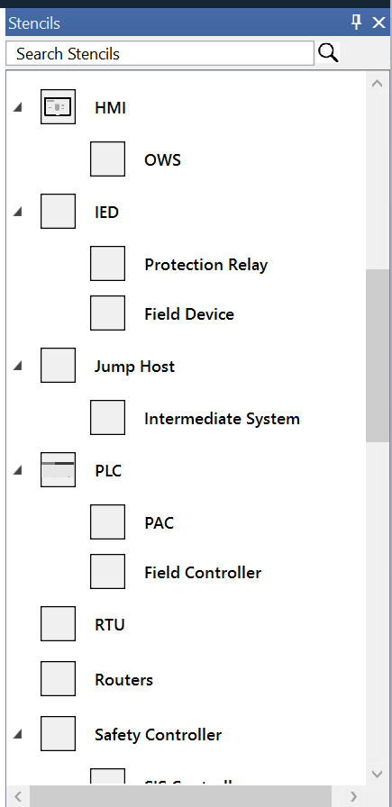
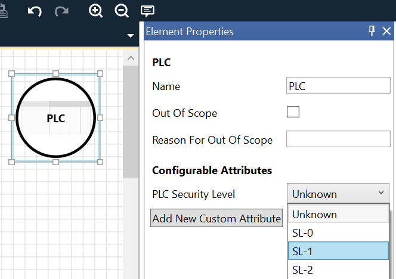
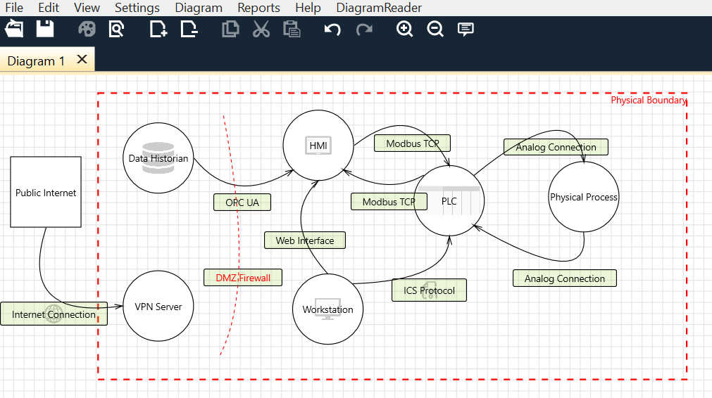
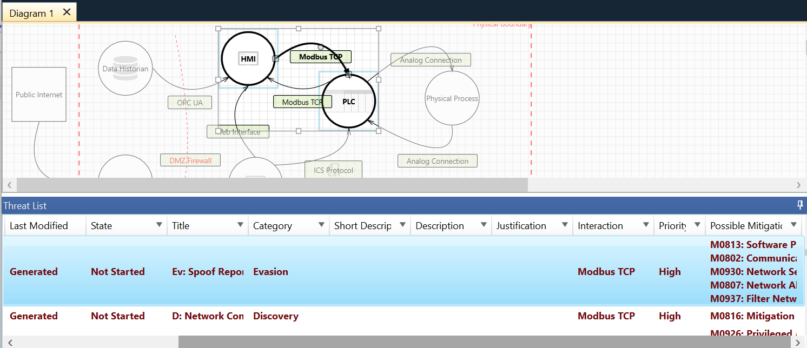

# OT Threat Modeling Toolkit

**A free, open-source extension for the Microsoft Threat Modeling Tool, purpose-built for ICS/OT environments.**  
This project brings MITRE ATT&CK for ICS and ISA/IEC 62443 logic into threat modeling, so it can be more easily integrated into the rest of your OT security program.

---

## ✨ What It Does

- 🧱 **Custom OT stencils**: PLCs, RTUs, HMIs, protocols like Modbus and DNP3
- ⚔️ **Threat generation rules** based on MITRE ATT&CK for ICS
- 🔐 **Security Level attributes** (SL-0 to SL-4) for assets, aligned with 62443
- 📊 **External scripts** to analyze models, including:
  - Summarizing assets by SL
  - Identifying lowest SL in the model
  - (Coming soon) Detecting SL gaps and threat model drift
- 🧰 Compatible with the Microsoft Threat Modeling Tool (.tm7 files)

---

## 📦 Project Status

> 🧪 Currently in early preview. Threat generation logic and security level attributes are implemented.  
> CLI utilities and SL evaluation scripts are being added incrementally.  
> See the [roadmap](#roadmap) for upcoming features.

---

## 🚀 Quick Start

1. Download and install the [Microsoft Threat Modeling Tool](https://learn.microsoft.com/en-us/azure/security/develop/threat-modeling-tool).
2. Clone this repo:
```bash
git clone https://github.com/Fortiphyd/ot-threat-modeling.git
```
3. Open the `MITRE_ICS.tb7` file in TMT
4. Add components to your diagram, threats are generated automatically
5. Use external scripts to analyze `.tm7` files

---

## 🔧 CLI Scripts

### `summarize_sl.py`

Analyze a `.tm7` model file and summarize the security levels of all assets:

```bash
python summarize_sl.py path/to/model.tm7
```

Example output:

```
Security Level Summary:
  SL-0: 1
  SL-1: 2
  Unknown: 3

```

---

## 🛣 Roadmap

- [x] Stencils for common OT protocols and assets
- [x] Threat generation from ATT&CK for ICS
- [x] Asset SL attributes (SL-0 through SL-4)
- [x] CLI script to summarize SL usage
- [ ] Reducing threat noise with more intelligent rules
- [ ] Threat model diffing and CI/CD integration

---

## 📸 Screenshots

OT specific stencils



Security levels



Example diagram



Generated Threats and Suggested Mitigations




---

## 🤝 Contributing

We welcome contributions! See [CONTRIBUTING.md](CONTRIBUTING.md) for how to get started.

---


## 🙏 Acknowledgements

- [MITRE ATT&CK for ICS](https://attack.mitre.org/matrices/ics/)
- [ISA/IEC 62443](https://www.isa.org/standards-and-publications/isa-standards/isa-iec-62443)
- [Microsoft Threat Modeling Tool](https://learn.microsoft.com/en-us/azure/security/develop/threat-modeling-tool)


